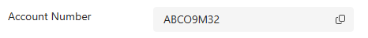
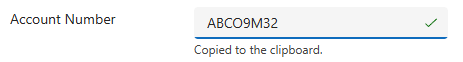

# Copy Field

A text column with a copy-to-clipboard button and a confirmation.

[](https://github.com/pcfhub/pcf-copy-field/actions/workflows/build.yml)
[](https://github.com/pcfhub/pcf-copy-field/actions/workflows/release.yml)

Documentation lives on [PCFHub](https://pcfhub.dev/components/pcf-copy-field), built
from the `docs/` directory in this repository. Edit the Markdown here; the hub
recompiles it.

<!-- Plain Markdown, not the hub's ::image directive: GitHub renders this file
     and does not understand the directives, which the hub compiles only for
     pages under docs/. -->





## What it does

Adds a copy-to-clipboard button to a bound `SingleLine.Text` column, with a
confirmation that is announced to a screen reader as well as shown — and an
explicit failure message when the host will not grant clipboard access, rather
than a button that quietly does nothing.

Built for the read-only value: a case reference, a generated account number, an
API key. The platform gives those no copy affordance at all, so people select
the text by hand and hope they caught the whole string.


## Properties

| Name | Type | Usage | Notes |
|---|---|---|---|
| `Value` | SingleLine.Text | bound | The column to display and copy. Also the output — typing writes back. |
| `Placeholder` | SingleLine.Text | input | Hint text while the column is empty. Display only; never copyable. |

The button's accessible name is built at runtime from the field's label on the
current form, so it is not a property. Full reference: [docs/api.md](docs/api.md).


## On the hub

[pcfhub.dev/components/pcf-copy-field](https://pcfhub.dev/components/pcf-copy-field)
— documentation, both solution downloads, and a live demo.

The demo copies for real — `demo.fidelity` is `full`. PCFHub sandboxes
third-party controls to `allow-scripts` on an opaque origin, which denies
`navigator.clipboard`, and the `execCommand` fallback goes through anyway
because it predates Permissions-Policy. The demo was shipped as `limited` on
the strength of the first half of that sentence and corrected once somebody
pressed the button.


## Install

Download the managed solution from the
[latest release](https://github.com/pcfhub/pcf-copy-field/releases/latest), or from
the component's page on the hub, and import it into your environment.

## Develop

```bash
npm install
npm start          # the PCF test harness
npm run build
npm run lint
npm run check      # what CI runs first: placeholders, pcfhub.json, control shape
```

Run `npm run refreshTypes` after every manifest edit — until you do,
`context.parameters` is typed from the old manifest and `tsc` will accept code that
cannot work.

To pack the solution locally you need msbuild — either Visual Studio or the
Visual Studio Build Tools:

```bash
cd Solution
msbuild /t:build /restore /p:configuration=Release
```

Both zips land in `Solution/bin/Release`. This is the only local step that compiles
in **production** mode, so a green `npm run build` is not evidence the shipping
bundle compiles — and the pack is incremental, so delete `obj/`, `out/`,
`Solution/obj/` and `Solution/bin/` first if you intend to quote a bundle size from
it.

## Release

1. Bump the version in **three** places, in one commit — they are checked
   against each other in CI:
   - `CopyField/ControlManifest.Input.xml` → `<control version="…">`
   - `Solution/src/Other/Solution.xml` → `<Version>`
   - `package.json` → `"version"`
2. Tag it: `git tag v1.2.3 && git push --tags`

The release workflow builds, packs both solution types, and attaches them to a
GitHub Release. PCFHub picks the release up from its webhook within seconds, or
from the hourly sweep otherwise. A sync imports a draft; a person publishes it.

## Repository layout

| Path | What it is |
| --- | --- |
| `CopyField/` | The control: manifest, entry point, CSS, localised strings |
| `Solution/` | The Dataverse solution that packages it |
| `SPEC.md` | What building this corrected, and what is verified versus read |
| `docs/` | The pages PCFHub publishes — see the comments in each file |
| `media/` | Images and video referenced from the docs |
| `pcfhub.json` | The hub's manifest: identity, links, docs path, demo |
| `scripts/` | Template setup and the CI guard that keeps it adopted |

## Licence

[MIT](LICENSE)
